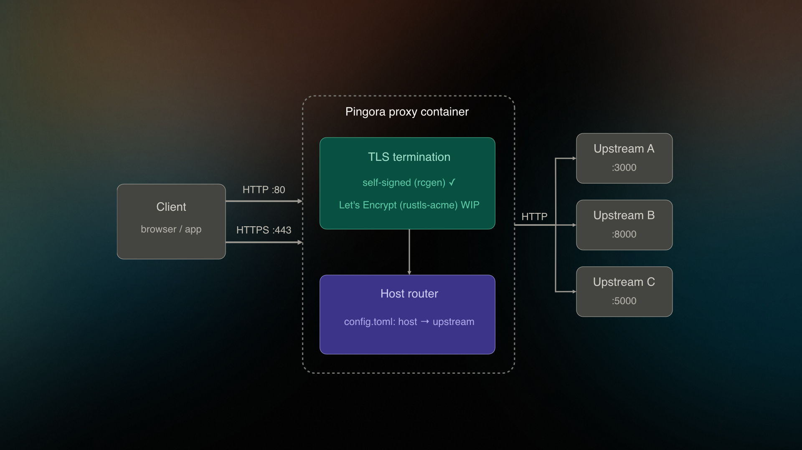

# Reverse Proxy

<p align="center"></p>

I normally use `nginxproxy/nginx-proxy` as my proxy on my self-hosted projects, but it always needs to be on the same network with `VIRTUAL_HOST` set for each docker compose instance. Not a big issue, but not how I like my projects to behave. I'll learn a lot writing my own (yes, old skool without AI) and end up with something simple and performant.

## Usage

The image is published to GHCR as `ghcr.io/mvdschee/proxy`. It runs as a non-root user on a hardened Alpine base (DHI), exposes `8080` (HTTP) and `8443` (HTTPS) inside the container, and reads its config from `/etc/proxy/config.toml`. Certificates are persisted under `/var/lib/proxy/certs`.

Minimal `docker-compose.yml`:

```yaml
services:
   proxy:
      image: ghcr.io/mvdschee/proxy:latest
      restart: unless-stopped
      ports:
         - "80:8080"
         - "443:8443"
      volumes:
         - ./config.toml:/etc/proxy/config.toml:ro
         - proxy-certs:/var/lib/proxy/certs
      extra_hosts:
         - "host.docker.internal:host-gateway"
      read_only: true
      security_opt:
         - no-new-privileges:true
      cap_drop:
         - ALL
      tmpfs:
         - /tmp

volumes:
   proxy-certs:
```

Drop a `config.toml` next to the compose file (see [`example/example.toml`](example/example.toml) for the schema) and `docker compose up -d`.

## Development roadmap

- [x] setup [hardened docker image](https://hub.docker.com/hardened-images/catalog)
- [x] add TOML config for domains (host: example.com, tls: self-signed|acme, upstream: 127.0.0.1:3000)
- [x] setup init process to parse config
- [x] generate new self signed ssl on reboot (rcgen)
- [x] start proxy with those values (with pingora)
- [ ] V2 rustls-acme with lets encrypt

## AI disclaimer

For each public project I'll be upfront about what was done with AI.

For this one I don't want to use AI to write the code. I want to keep my skills sharp and have 100% understanding of every bit that went into it. That said, the following was done with AI:

- Research about the project
- Cleanup of the README and other text
- Discussion about code solutions
- Create the docker images based on example and spec

# ROADMAP

- Make each part idiomatic after working V1
